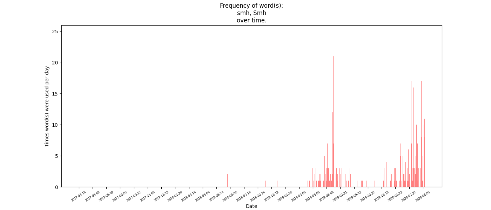

# Instagram Data Experiments
The files in this repo are experiments and small projects with own personal Instagram data. This README file serves as a map of this project, a description of every script, and instructions. These experiments include data parsing, visualization, and text generation using Tensorflow.

## Running
Clone repo and install requirements:
```
~$ git clone https://github.com/Visual-mov/Insta-Expirements
~$ cd ./Insta-Expirements
~$ pip install -r requirements.txt
```

Every script takes arguments from the console. If no arguments are given, the script will not execute and the needed arguments will be shown.

## Parsing
This folder contains the raw json data from Instagram as well as various scripts that convert and process the data.

### *log_generator*
Generates a text log of Instagram dms from `messages.json`. The log can be generated with a stamp including the date and account, or it can just be the raw text (for the purpose of training data). This log is used by many other scripts.

### *filter_log*
Filters message log to only contain printable characters, and emojis. Serves the purpose of removing redundant unicode characters that only appear a few times in the training data.

## Visualization
Contains scripts for visualizing the Instagram data.

### *pie_messages*
Shows the total number of messages by each person in a log as a pie chart, as well as their username and percentage out of every message.

### *word_freq*
Displays frequency of the usage of a word over time. The amount of times the word(s) are said is added up per day, and graphed. Note that it counts the word only if there's no alphanumeric characters on either side. So for example the word `he` would not be found in the message `help`.

### *like_freq*
Displays the amount of likes every n days from the `likes.json` data. The days between n are not counted or averaged.

## InstaRNN
InstaRNN is a Recurent Neural Network model for the raw Instagram DM log made by the log-generator.

### *model*
Contains the Tensorflow model for InstaRNN, as well as other helper functions for training and generating text.

### *train*
Trains on a generated Instagram log and saves the weights of that model for use by other scripts.

### *generate_text*
Generates text from the trained model, and saves it to a text file. The text generated is in the style of the training data (Instagram DMs).

### *phrase_generator*
Reads aloud and displays phrases generated by the model. The beginning of the phrase is randomly picked, and then finished by the model.

## Results
I'll include some images and text generated from my own data, they don't expose any super private information.

### The frequency of me saying 'smh' in dms over time.


### Generated text by InstaRNN trained on my Instagram dms.
```
typing for a second
Most likely
Lol right
Wow
No
do the news go with known't make the roms
The thing is nkil
rip
I'm still think of that
Ah okay
But you can have time I'm bored
Cool!
Yeah
Lol
I will taken
que
Trump
That's me when mu suberter
By using one of them
That cuts catch on, but not bornie roomer
```
